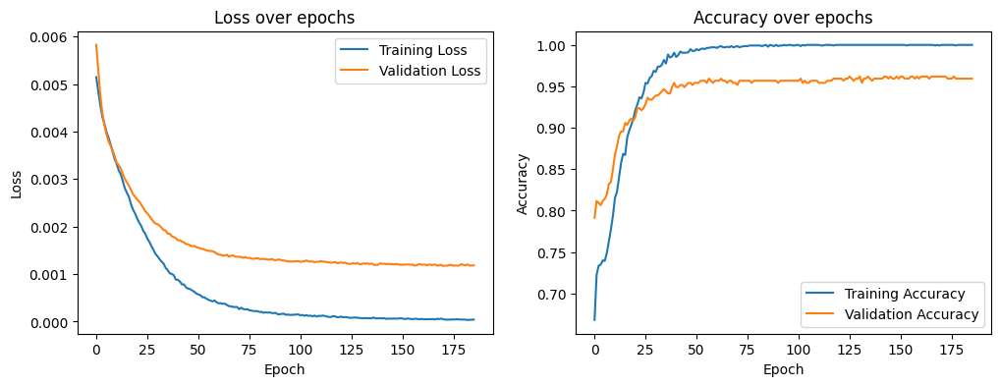
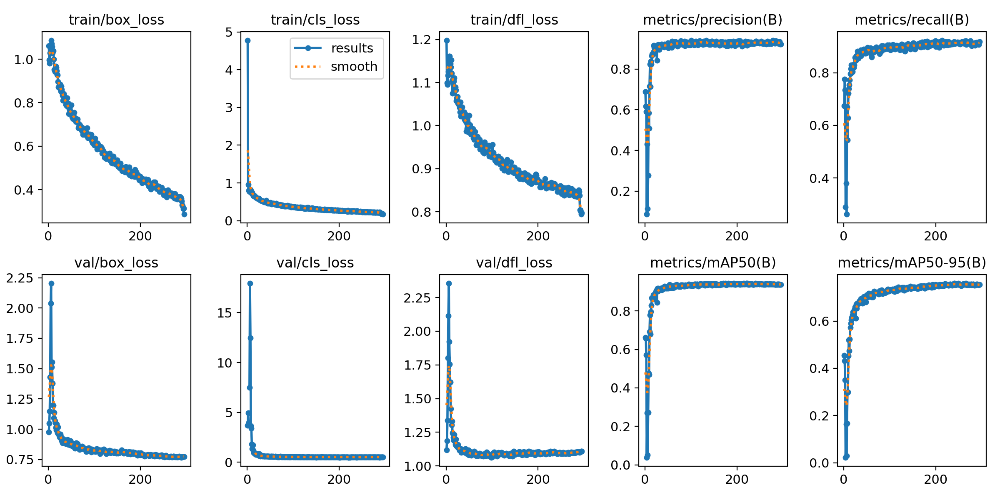
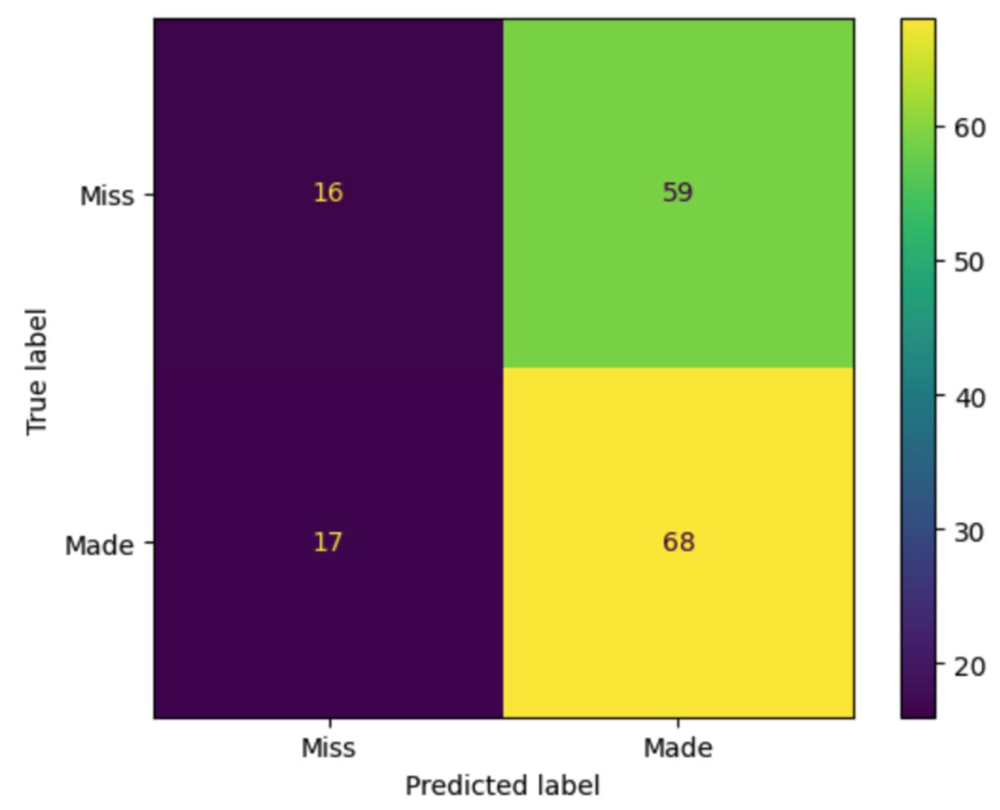
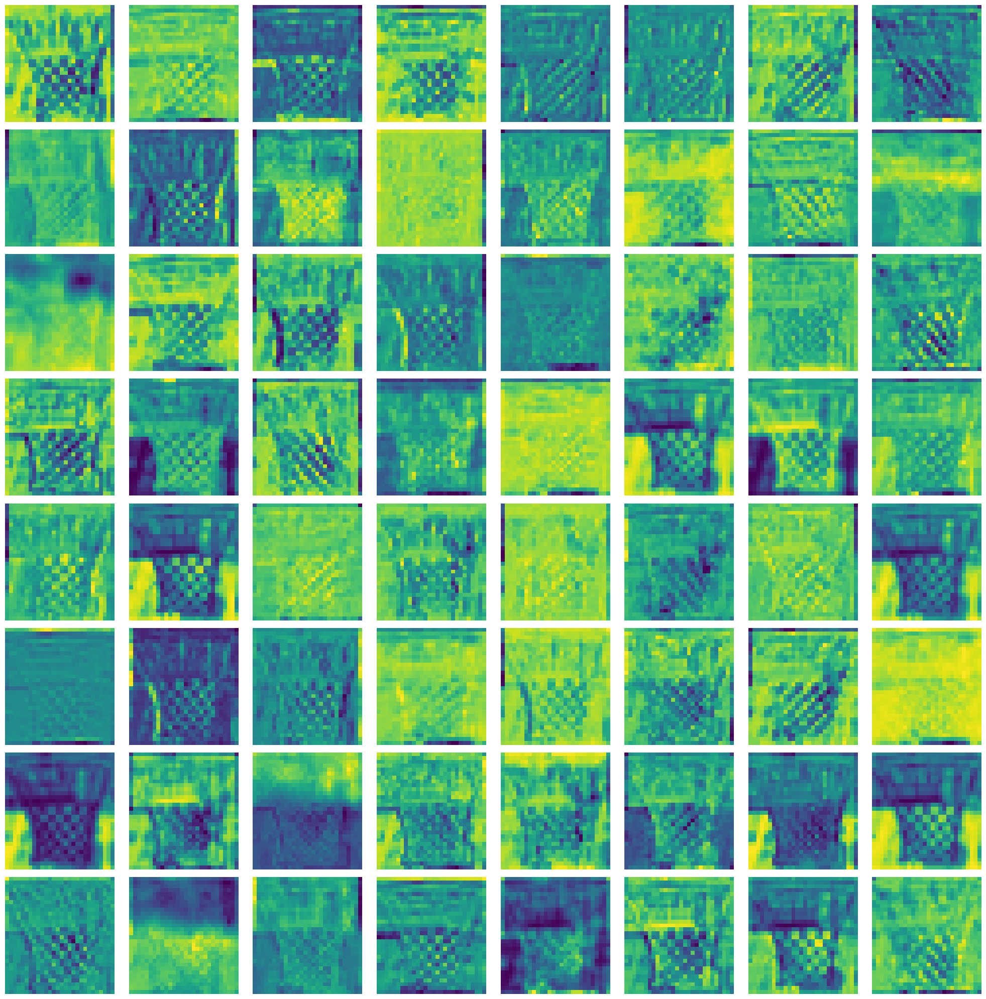
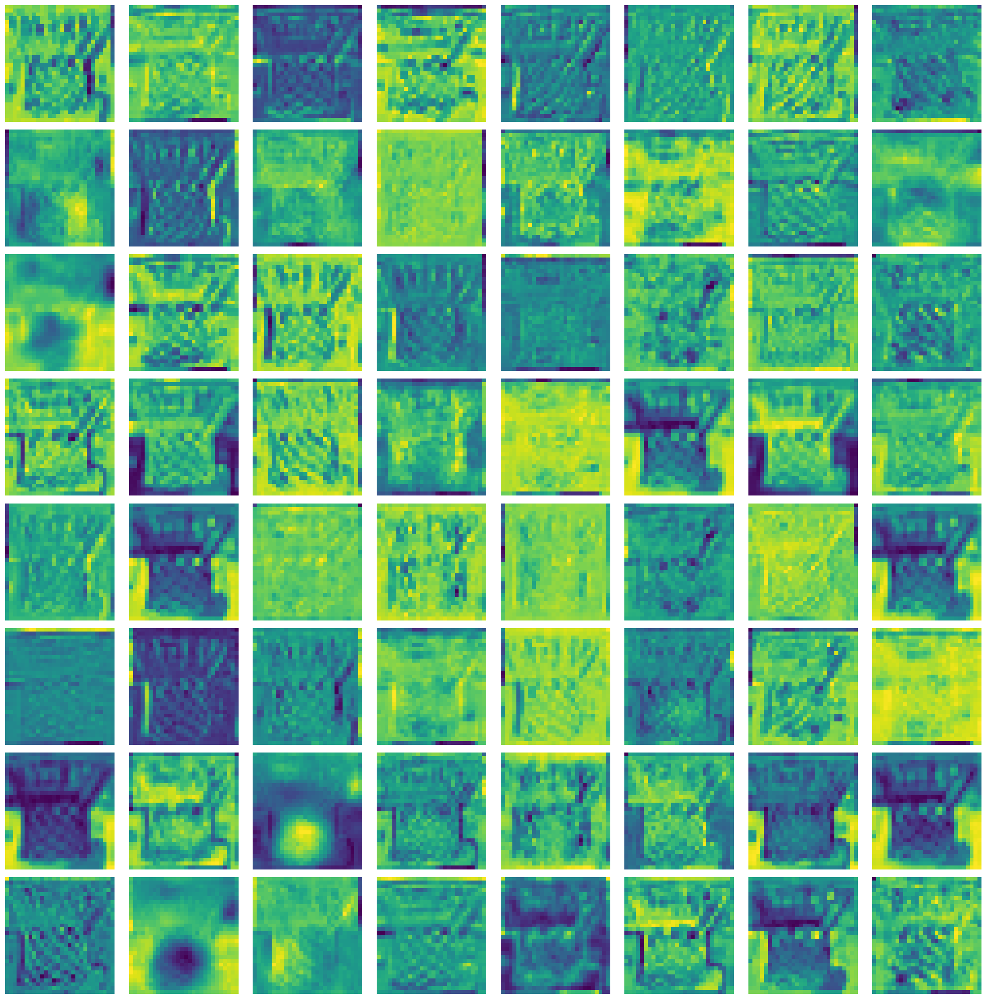

# Court Vision
This pproject applies object detection and image classification to automatically detect scoring events in amateur basketball videos.

## Introduction
Finding all scoring highlights in an amateur basketball video is time consuming. Unlike professional games where each score triggers a game clock stoppage or replay, amateur games lack these built-in cues. This makes it difficult to spot scoring events. Our goal is to develop a system to automatically detect scoring events in those footages.

## Repository and Code Structure

`cls_detection.py` is the script that inference on a video witht the YOLO+ResNet50 system, which returns the scoring timestamps and probabilities. 
Run `python cls_detection.py [YOLO_MODEL_PATH] [CLS_MODEL_PATH] [VIDEO_PATH]` with options like `--cls_conf_threshold` and `--save_result_vid` to process videos using YOLO and classification models with customizable settings.
You can also try it in `detection_with_cls.ipynb`. We used this notebook to test the performance of YOLO+ResNet50.  
`detection_only.ipynb` is the notebook for the YOLO+conditions system.  

## Results

### YOLO + Resnet50
ResNet50 training result:
 

YOLOv8-Large training result:

The performance of this system is underwhelming, see below confusion matrix:

We looked at the feature map to see if the model is looking at the wrong thing. It seems like ResNet is looking at the correct things: we can tell that some of the filters are looking at the net, and some are looking at the ball (if present).

Empty basket:

    

With a ball:     

We hypothesize that the poor performance of the system despite the excellent performance of ResNet50 during trainig and testing is due to data leakage. Because we have many images of hoops from the same backgrounds, the training, validation, and testing sets will contain images from the same background. To improve this, we need to first split the videos where we get the images from into 3 sets, and then crop the hoops.

### YOLO

- Entire ball inside hoop

  Accuracy: 0.638
  
  Precision: 0.787
  
  Recall: 0.435
  
  False Positive Rate (FPR): 0.133
  
  False Negative Rate (FNR): 0.565

- Ball center inside hoop

  Accuracy: 0.706
  
  Precision: 0.797
  
  Recall: 0.600
  
  False Positive Rate (FPR): 0.173
  
  False Negative Rate (FNR): 0.400

- Ball trajectory through hoop

  Accuracy: 0.738
  
  Precision: 0.772
  
  Recall: 0.718
  
  False Positive Rate (FPR): 0.240
  
  False Negative Rate (FNR): 0.282

The ball center method has decent accuracy and recall, though it struggles when the basketball net blocks the ball inside the hoop, causing missed detections (high false negative rate).

The entire ball approach is further limited by the basketball net obstruction. 

We developed the trajectory technique to predict made shots by the ball path without needing to visually see inside the hoop. This improved false negatives but fundamentally cannot resolve false positives of balls passing behind/in-front of the hoop in 2D view.

## Conclusion

To summarize our project, we first experimented with different object detection models and then proposed combining a classification model for better performance. After training and evaluating candidate models, we narrowed down YOLOv8-Large and ResNet50 as top choices. We created two systems using these models for scoring detection and evaluated them on amateur basketball video dataset. However, issues around depth perspective, video quality, and generalization remain. Going forward, approaches such as model ensembles or temporal video analysis may better capture the intricacies of amateur basketball footage.
  
